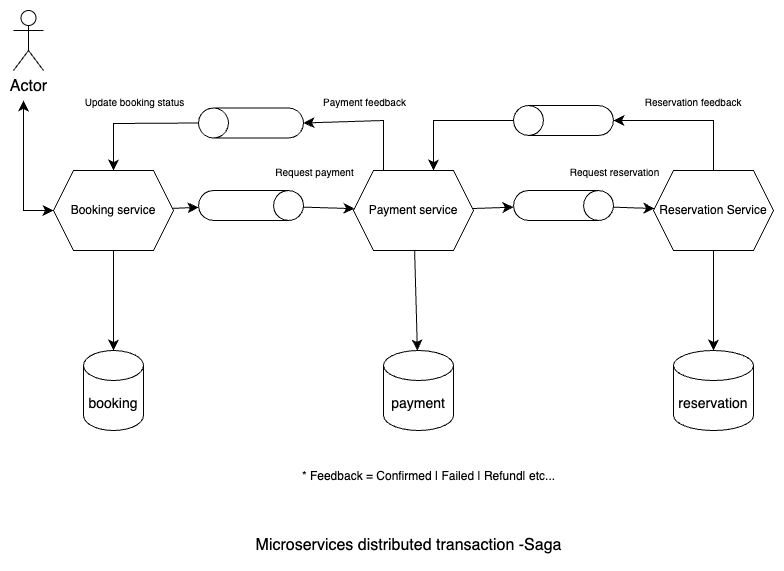
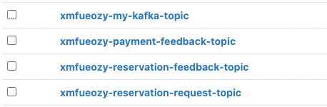

### Saga design pattern
#### Choreography or Orchestration
https://camunda.com/blog/2023/02/orchestration-vs-choreography/

Choreography: 
choreography refers to the coordination and organization of interactions between different software components or systems. It is a design pattern that enables the development of distributed systems where the components interact with each other through a set of well-defined interfaces, without requiring a central authority or coordinator.

Orchestration: 	
Orchestration refers to the coordination and management of the interactions and dependencies between different software components or systems. It is a design pattern that enables the development of distributed systems where a central authority or coordinator is responsible for managing and coordinating the actions of the different components.

Choreography vs Orchestration : See the pic in above link

----------
- This implementation

Booking Service: End user books for travel. Enter details. 
It calls for payment service and wait for feedback and update booking status accordingly

Payment Service: Calls Reservation service and wait for feedback. Based on the feedback received 
it updates payment status and send feedback to Booking service

Reservation Service: Reserve hotel, cab etc. It sends feedback to payment service

-----
 ### Run in local 
 - JDK 17
 - Kafka topic : Here I have used cloudkarafka free account

 - H2 Database
    - Booking db: http://localhost:8010/h2-console
    - Payment db: http://localhost:8011/h2-console
    - Reservation db: http://localhost:8012/h2-console
    - 
 - Test Success scenarios 
URL: http://localhost:8010/api/v1/booking [POST]
`{
"guestName": "Sudipta Maity",
"destination": "Darjeeling",
"startDate": "2023-10-15",
"endDate": "2023-10-16",
"noOfGuests": 3
}`
 - Test Payment failure
   `{
   "guestName": "Sudipta Maity",
   "destination": "Darjeeling",
   "startDate": "2023-10-15",
   "endDate": "2023-10-16",
   "noOfGuests": 1
   }`
  - Test Reservation failure
     `{
     "guestName": "Sudipta Maity",
     "destination": "Darjeeling",
     "startDate": "2023-10-15",
     "endDate": "2023-10-16",
     "noOfGuests": 13
     }`

-----
Note: Implementing SAGA (Choreography) is not very simple. Code is not very clean nad 
maintainable. Maybe we should look for some framework like Camunda ? 
Here I assume all the compensating transactions are non failure.

- How to handle the failure of compensating transactions in SAGA ?
   
    Compensating transactions can not fail. If it fails, it may lead to data inconsistency. 
    In order to ensure compensating transaction doesn't fail, we can consider Event Sourcing and state management 
    for services.

    Event Sourcing & Event store
     
     https://microservices.io/patterns/data/event-sourcing.html

      A good solution to this problem is to use event sourcing. Event sourcing persists the state of a business entity 
      such an Order or a Customer as a sequence of state-changing events. Whenever the state of a business entity changes,
      a new event is appended to the list of events. Since saving an event is a single operation, it is inherently atomic. 
      The application reconstructs an entity’s current state by replaying the events.
      Applications persist events in an event store, which is a database of events. 
      The store has an API for adding and retrieving an entity’s events. 
      The event store also behaves like a message broker. It provides an API that enables services to subscribe to 
      events. When a service saves an event in the event store, it is delivered to all interested subscribers.

    Consider using frameworks - 
      AWS Step functions, Eventuate, AxonIQ, SEATA
    

